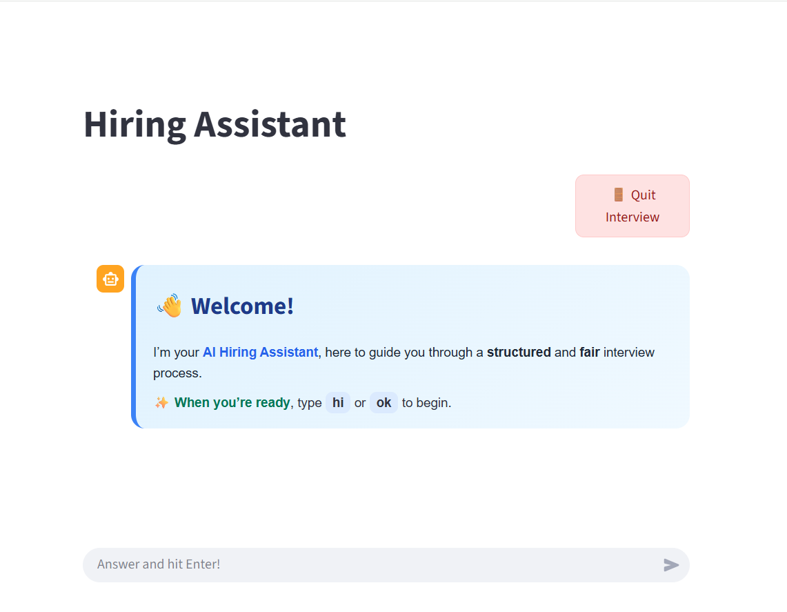
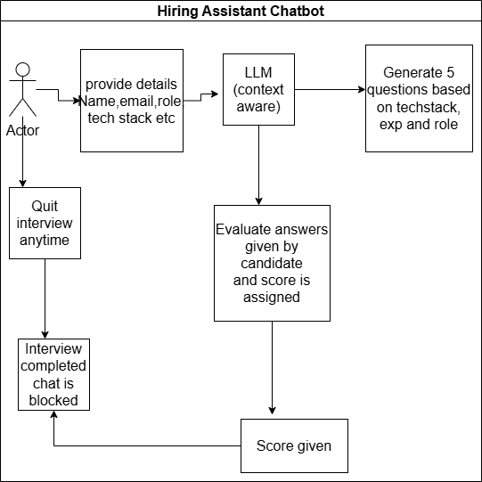

## Hiring Assistant System

Problem Statement:
developing an intelligent Hiring Assistant chatbot for,a fictional recruitment agency specializing in technology placements called  "TalentScout".
The chatbot should assist in the initial screening of candidates by gathering essential
information and posing relevant technical questions based on the candidate's declared tech stack
Hiring Assistant is a chatbot designed to help interview HR teams/Technical team automate routine workflows.
It is a Hiring Assistant developed using LLM,prompt engineering and Streamlit

OBJECTIVES:
STEP1:

What the bot does:
->Greet candidate
->collect details
->Ask tech specific questions
->End Conversation

What the bot doesn't do?
->Free/random chat
->Answer random questions
->store data permanently

Technical details:

🛠️ Setup Instructions

To set up and run Hiring Assistant, follow these steps:

pip install -r requirements.txt
streamlit run app.py

Used llama-3.3-70b-versatile model as LLM and have successfully controlled its behaviour.

Usage:
on user interface provide below details:

->name
->email
->phone number
->experience(in years/months)
->desired role
->tech stack
GREETING → NAME → EMAIL → EXPERIENCE → ROLE → PHONE NUMBER → TECH STACK → GENERATE QUESTIONS(by LLM and prompts) →
->bot provides technical questions from the tech stack+experience+role(context aware based questions) provided by user

## Architecture

##Video

Streamlit is used for user interface and evry field on chatbot like name,email,phone number
are validated using Regular expression if required, this code is available in utils.py

llm_utils.py file contains the LLM and prompt related code
app.py has streamlit related code

All rights reserved @Pratibha Kambi
